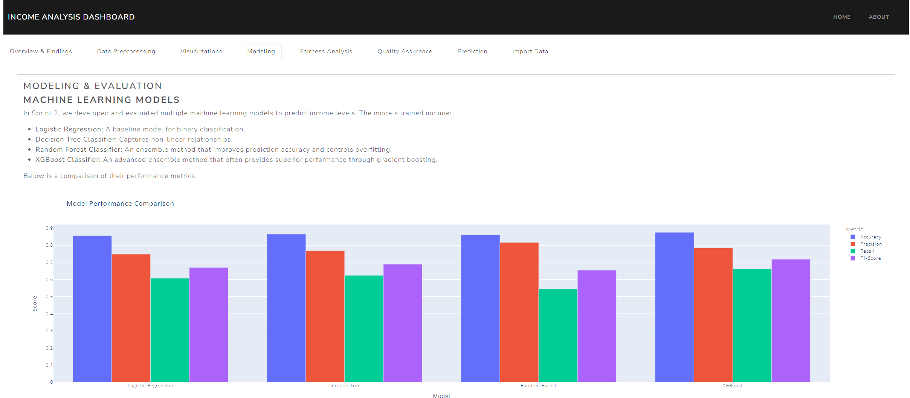

# Income Analysis Dashboard

## Overview

The Income Analysis Dashboard is a powerful, interactive web application built with Python and Dash. It enables users to analyze income data, make predictions, and gain insights through visualizations of various demographic factors influencing income levels.



## 🚀 Features

- **Interactive Data Upload**: Upload your datasets or generate fake data for testing
- **Machine Learning Models**: Access multiple trained models for income prediction
- **Fairness Analysis**: Evaluate model fairness across demographic groups
- **Comprehensive Visualizations**: Gain insights through various chart types
- **Public Access**: Share your dashboard using Ngrok for remote access

## 🛠️ Installation

1. Clone the repository:
   ```bash
   git clone https://github.com/BradyMeighan/income-analysis-dashboard.git
   cd income-analysis-dashboard
   ```

2. Create and activate a virtual environment (optional but recommended):
   ```bash
   python -m venv venv
   source venv\Scripts\activate  # On Linux, use `venv/bin/activate`
   ```

3. Install dependencies:
   ```bash
   pip install -r requirements.txt
   ```

## 🏃‍♂️ Running the App

### Locally
```bash
python app.py
```
Access the dashboard at `http://localhost:8050`

### Publicly with Ngrok

To make your dashboard accessible over the internet, you can use Ngrok. Follow these steps to set up and use Ngrok:

1. **Download Ngrok**:
   - Visit the [Ngrok download page](https://ngrok.com/download)
   - Download the version appropriate for your operating system

2. **Place ngrok.exe in the Project Folder**:
   - Extract the downloaded file
   - Move `ngrok.exe` to the root directory of your Income Analysis Dashboard project

3. **Set Up Ngrok Authentication**:
   - Sign up for a free Ngrok account at [https://dashboard.ngrok.com/signup](https://dashboard.ngrok.com/signup)
   - After signing in, go to the [Auth Token section](https://dashboard.ngrok.com/get-started/your-authtoken)
   - Copy your auth token
   - Open a command prompt or terminal in your project directory and run:
     ```bash
     ngrok config add-authtoken YOUR_AUTH_TOKEN
     ```
   Replace `YOUR_AUTH_TOKEN` with the token you copied.

4. **Start the Dash App**:
   ```bash
   python app.py
   ```

5. **Run Ngrok**:
   - Open a new command prompt or terminal window
   - Navigate to your project directory
   - Run the following command:
     ```bash
     ngrok http 8050
     ```
   - Ngrok will display a forwarding URL (e.g., `https://abc123def456.ngrok.io`)

6. **Access Your Dashboard**:
   - Share the Ngrok URL with others to give them access to your dashboard
   - The dashboard will be accessible as long as your local server and Ngrok are running

## 🎲 Fake Data Generation

To help you test the dashboard without real data, we've provided a script (`fakedata.py`) to generate synthetic income data. This script creates realistic fake data based on the distributions and ranges found in the original dataset.

### How it works:

1. The script reads from two Excel files: `adult.xlsx` (original data) and `salary_datafields.xlsx` (field definitions).
2. It identifies categorical and numerical columns based on the field definitions.
3. For categorical data, it generates values based on the distribution in the original dataset.
4. For numerical data, it generates values within the realistic range of the original data, following a normal distribution.

### To use the script:

1. **Ensure Required Files Are Present**:
   Make sure `adult.xlsx` and `salary_datafields.xlsx` are in your project directory.

2. **Run the Fake Data Generation Script**:
   Execute the following command:
   ```bash
   python fakedata.py
   ```

3. **Specify the Number of Entries**:
   When prompted, enter the number of fake data entries you want to generate.

4. **Locate the Generated File**:
   After running the script, a new file named `fake_data.csv` will be created in your project directory. This file contains the synthetic data you can use to test the dashboard.

5. **Review the Output**:
   The script will display the first 10 rows of the generated data and the total number of entries created.

### Using the Fake Data:

You can now use the `fake_data.csv` file in the "Import Data" tab of your dashboard to test its functionality with a controlled dataset.

Note: While this fake data mimics the distributions and ranges of the original dataset, it is still synthetic and should be used for testing purposes only. It may not capture complex relationships or nuances present in real-world data.

## 🤝 Contributing

Contributions are welcome! Please fork the repository and create a pull request with your features or fixes.

## 📄 License

This project is licensed under the MIT License.

## 📞 Contact

- Email: meighanba@vcu.edu
- GitHub: [@BradyMeighan](https://github.com/BradyMeighan)
- LinkedIn: [Brady Meighan](https://www.linkedin.com/in/brady-meighan)

## 👥 Team (Group 9)

- Margarita Damalas - [damalasma@vcu.edu](mailto:damalasma@vcu.edu)
- Hunter Hall - [hallhj@vcu.edu](mailto:hallhj@vcu.edu)
- Susan Grube - [grubes@vcu.edu](mailto:grubes@vcu.edu)

Happy Analyzing! 📈🔍
